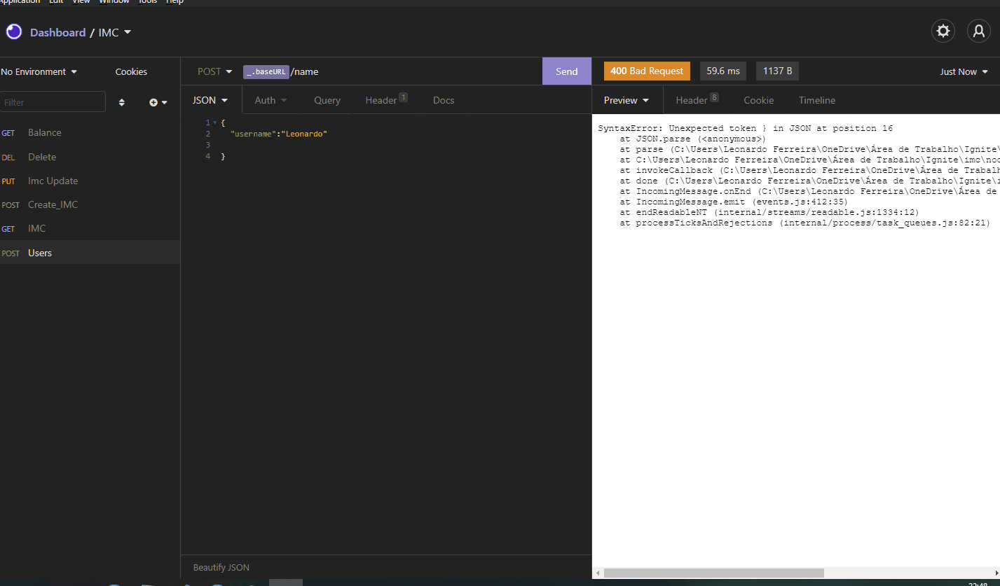

# Calculate IMC 

  

## Sobre

<h4 align="center">Projeto ainda em construção .... 🚧 </h4>

Projeto desenvolvido para testar fluxo de rotas no node e realizar um cálculo simples de IMC.

## Features

 

- [x] Criar todo fluxo de cálculo e cadastrado das informações
- [x] Middleware de verificação de usuário
- [x] Função de cálculo de IMC
- [ ] Arredondar valores de cálculo
- [ ] Inserir tabela de métrica de IMC, para verificar de acordo com o resultado

## Projeto

 

  

